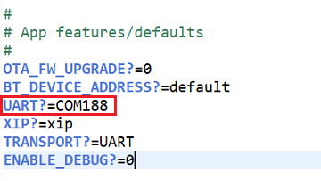
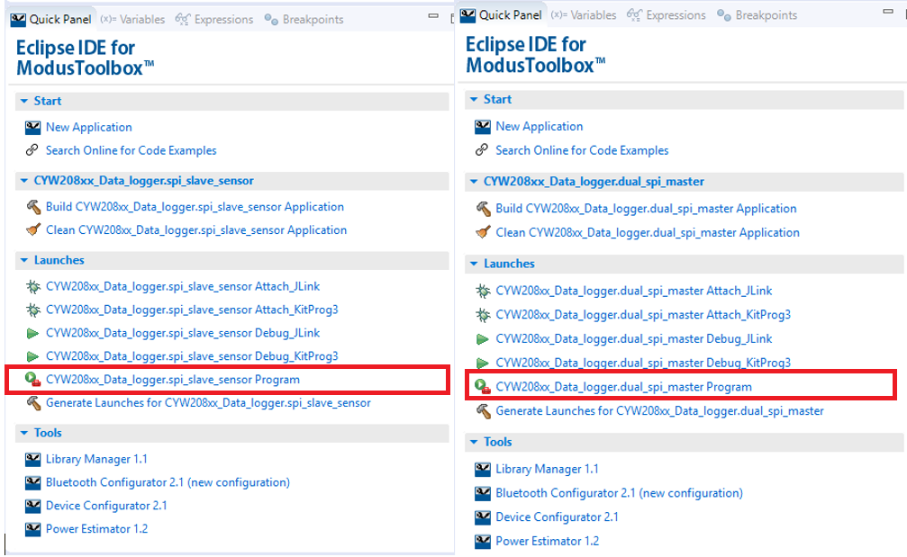
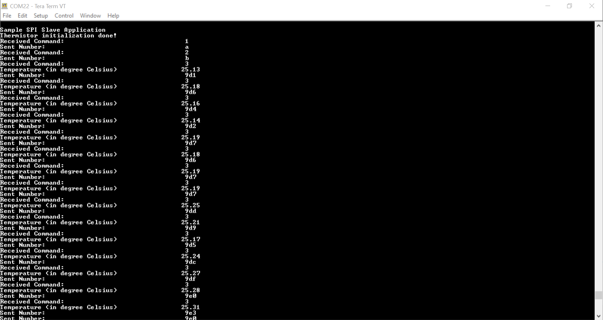
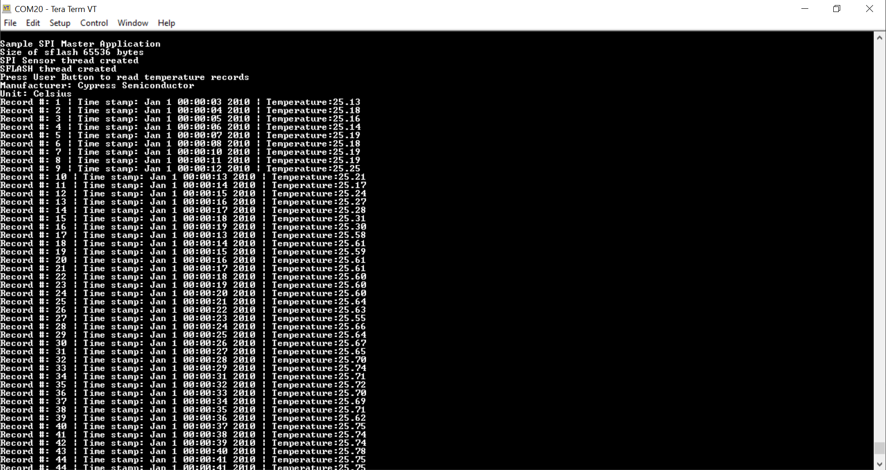
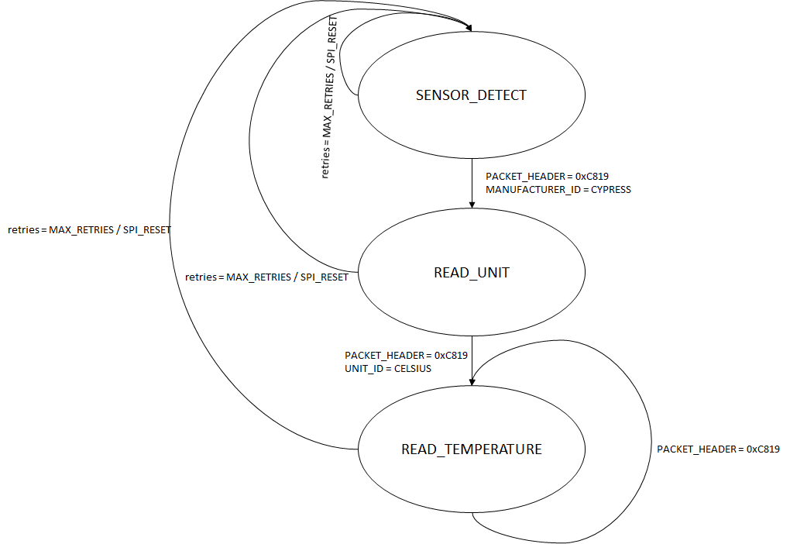
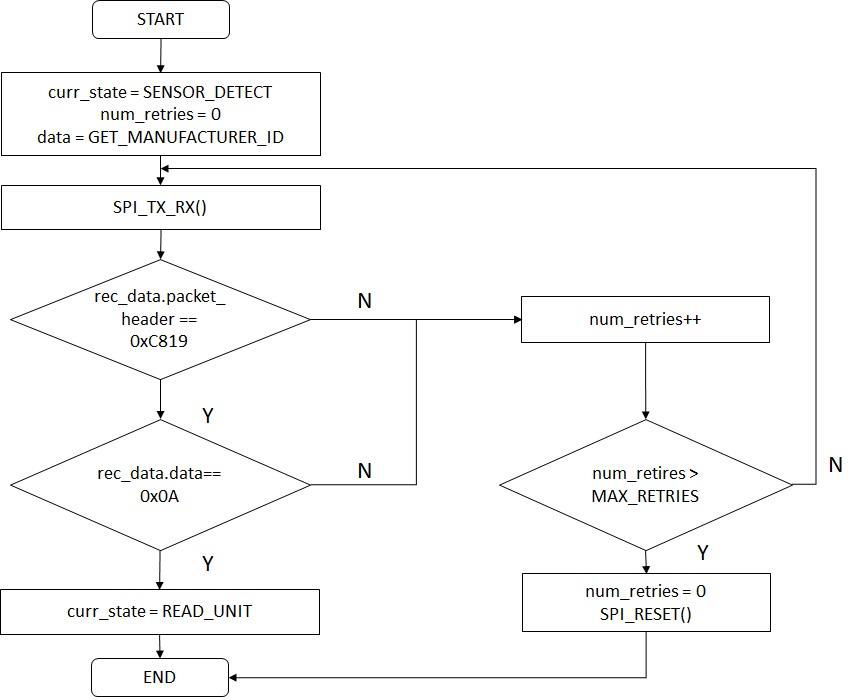
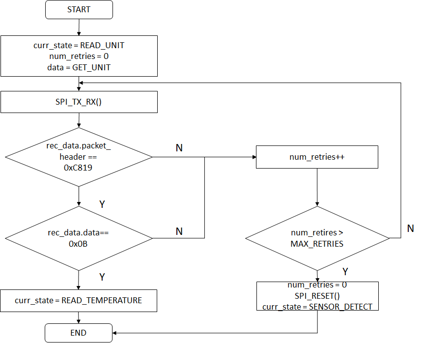
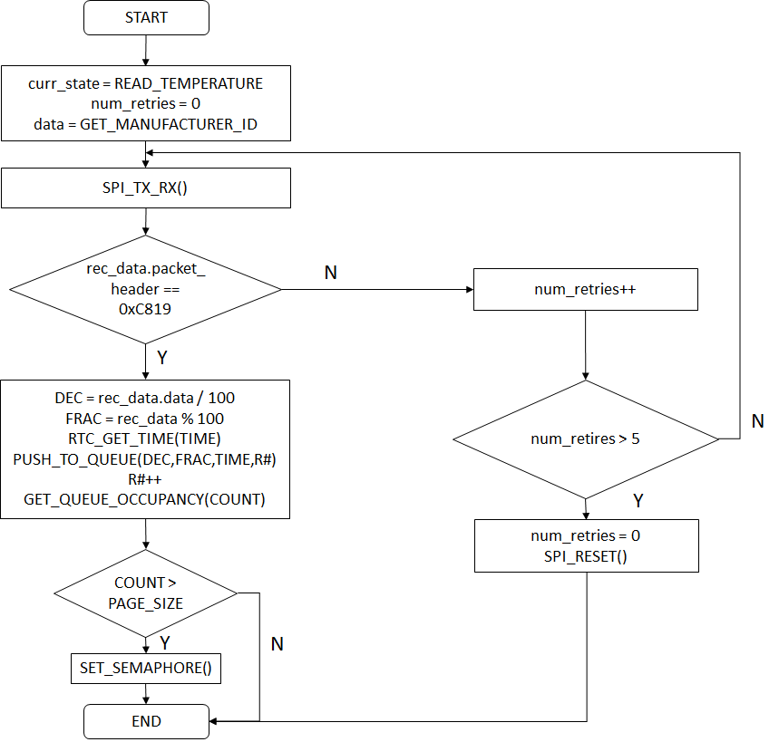
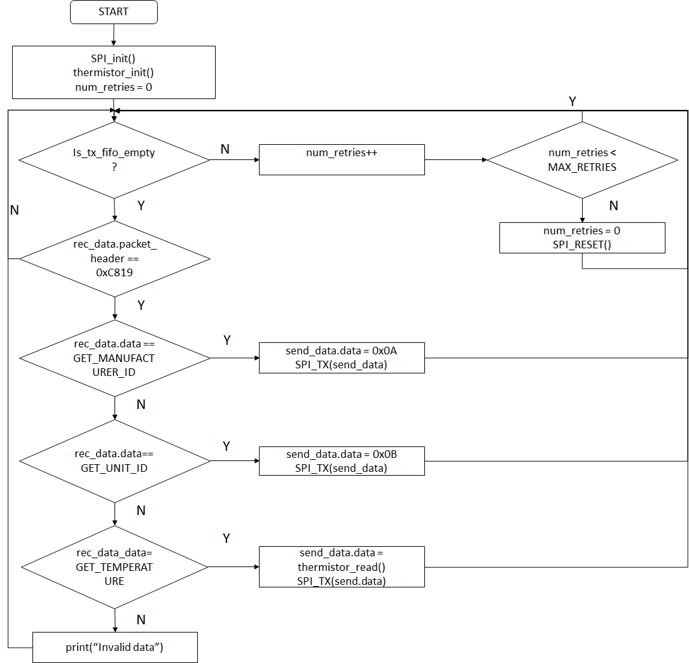

# BTSDK SPI-Based Datalogger

This code example includes two applications that demonstrate the operation of multiple Serial Peripheral Interface (SPI) interfaces using the CYW208XX Bluetooth SoC and ModusToolbox™. The first application demonstrates the operation of two SPI masters – one for collecting sensor data and the other for logging the data to external Flash. The second application demonstrates the operation of an SPI slave  used for providing sensor data to the first application.

## Requirements

- [ModusToolbox® software](https://www.cypress.com/products/modustoolbox-software-environment) v2.2

    **Note:** This code example version requires ModusToolbox software version 2.2 or later and is not backward compatible with v2.1 or older versions. If you cannot move to ModusToolbox v2.2, use the latest compatible version of this example: [latest-v1.X](https://github.com/cypresssemiconductorco/mtb-example-btsdk-cyw208xx-data-logger/tree/latest-v1.X).
- Board Support Package (BSP) minimum required version: 2.8.0
- Programming Language: C
- Associated Parts: [CYW20819](https://www.cypress.com/datasheet/CYW20819), [CYW20820](https://www.cypress.com/datasheet/CYW20820)

## Supported Toolchains (make variable 'TOOLCHAIN')

- GNU Arm® Embedded Compiler v9.3.1 (GCC_ARM) - Default value of `TOOLCHAIN`

## Supported Kits (make variable 'TARGET')

- [CYW920819EVB-02 Evaluation Kit](http://www.cypress.com/CYW920819EVB-02)
- [CYW920820EVB-02 Evaluation kit](http://www.cypress.com/CYW920820EVB-02)

## Hardware Setup
These applications run on two separate kits. Both applications use the kit’s default configuration. See the [kit guide](http://www.cypress.com/CYW920819EVB-02), if required, to ensure the kit is configured correctly. [Figure 1](#figure-1-block-diagram) shows the block diagram depicting the connections between different blocks of two evaluation boards.

##### Figure 1. Block Diagram

Make the connections as shown in [Table 1](#table-1-hardware-connections).

##### Table 1. Hardware Connections
<table style="width:100%"> 
<tr><th>Function</th><th colspan="3" align="center">Master</th><th colspan="3" align="center">Slave</th></tr>
<tr><td>CLK</td><td>WICED_P15</td><td>J3.8</td><td>D10</td><td>WICED_P15</td><td>J3.8</td><td>D10</td></tr>
<tr><td>MISO</td><td>WICED_P14</td><td>J3.10</td><td>D8</td><td>WICED_P14</td><td>J3.10</td><td>D8</td></tr>
<tr><td>MOSI</td><td>WICED_P13</td><td>J12.26</td><td>A05</td><td>WICED_P13</td><td>J12.26</td><td>A05</td></tr>
<tr><td>CS</td><td>WICED_P12</td><td>J12.5</td><td>A04</td><td>WICED_P12</td><td>J12.5</td><td>A04</td></tr>
<tr><td>GND</td><td>GND</td><td>J11.6</td><td>GND</td><td>GND</td><td>J11.6</td><td>GND</td></tr>
</table>

## Software Setup

Install a terminal emulator if you don't have one. Instructions in this document use [Tera Term](https://ttssh2.osdn.jp/index.html.en).

This example requires no additional software or tools.

## Using the Code Example

### In Eclipse IDE for ModusToolbox:

1. Click the **New Application** link in the **Quick Panel** (or, use **File** > **New** > **ModusToolbox Application**). This launches the [Project Creator](http://www.cypress.com/ModusToolboxProjectCreator) tool.

2. Pick a kit supported by the code example from the list shown in the **Project Creator - Choose Board Support Package (BSP)** dialog.

   When you select a supported kit, the example is reconfigured automatically to work with the kit. To work with a different supported kit later, use the [Library Manager](https://www.cypress.com/ModusToolboxLibraryManager) to choose the BSP for the supported kit and deselect the other BSPs. **Keep only the required BSP in your application** for more information refer [BTSDK Release Notes](https://community.cypress.com/community/software-forums/modustoolbox-bt-sdk). You can use the Library Manager to select or update the BSP and firmware libraries used in this application. To access the Library Manager, click the link from the Quick Panel.

   You can also just start the application creation process again and select a different kit.

   If you want to use the application for a kit not listed here, you may need to update the source files. If the kit does not have the required resources, the application may not work.

3. In the **Project Creator - Select Application** dialog, choose the example by enabling the checkbox.

4. Optionally, change the suggested **New Application Name**.

5. Enter the local path in the **Application(s) Root Path** field to indicate where the application needs to be created.

   Applications that can share libraries can be placed in the same root path.

6. Click **Create** to complete the application creation process.

For more details, see the [Eclipse IDE for ModusToolbox User Guide](https://www.cypress.com/MTBEclipseIDEUserGuide) (locally available at *{ModusToolbox install directory}/ide_{version}/docs/mt_ide_user_guide.pdf*).

   **Note**: Both the dual SPI master and SPI slave sensor applications are created for the same kit that you have selected in Step 2.


### In Command-line Interface (CLI):

ModusToolbox provides the Project Creator as both a GUI tool and a command line tool to easily create one or more ModusToolbox applications. See the "Project Creator Tools" section of the [ModusToolbox User Guide](https://www.cypress.com/ModusToolboxUserGuide) for more details.

Alternatively, you can manually create the application using the following steps.

1. Download and unzip this repository onto your local machine, or clone the repository.

2. Open a CLI terminal and navigate to the application folder(GATT_client or GATT_server).

   On Linux and macOS, you can use any terminal application. On Windows, open the **modus-shell** app from the Start menu.

    **Note:** The cloned application contains a default BSP file (*TARGET_xxx.mtb*) in the *deps* folder. Use the [Library Manager](https://www.cypress.com/ModusToolboxLibraryManager) (`make modlibs` command) to select and download a different BSP file, if required and deselect the other BSPs. **Keep only the required BSP in your application** for more information refer [BTSDK Release Notes](https://community.cypress.com/community/software-forums/modustoolbox-bt-sdk). If the selected kit does not have the required resources or is not [supported](#supported-kits-make-variable-target), the application may not work.

3. Import the required libraries by executing the `make getlibs` command.

Various CLI tools include a `-h` option that prints help information to the terminal screen about that tool. For more details, see the [ModusToolbox User Guide](https://www.cypress.com/ModusToolboxUserGuide) (locally available at *{ModusToolbox install directory}/docs_{version}/mtb_user_guide.pdf*).

### In Third-party IDEs:

1. Follow the instructions from the [CLI](#in-command-line-interface-cli) section to create the application, and import the libraries using the `make getlibs` command.

2. Export the application to a supported IDE using the `make <ide>` command.

    For a list of supported IDEs and more details, see the "Exporting to IDEs" section of the [ModusToolbox User Guide](https://www.cypress.com/ModusToolboxUserGuide) (locally available at *{ModusToolbox install directory}/docs_{version}/mtb_user_guide.pdf*.

3. Follow the instructions displayed in the terminal to create or import the application as an IDE project.


## Operation
1. Connect two boards to your PC using the provided USB cable. Note down the port enumerations for each device in **Device Manager > Ports (COM & LPT)** (Windows only). The enumeration with a smaller number is the **WICED HCI UART port** and the other is **WICED Peripheral UART port**.   

2. Open a terminal program and select the **WICED Peripheral UART** port for each board. Set the serial port parameters to 8N1 and 115200 baud.

3. Program the board.

   **Using Eclipse IDE for ModusToolbox**

   1. In the Project Explorer, expand each **\<Application Name>** project and open the corresponding makefile. Search for the UART parameter in the makefile and configure the parameter to match the **WICED HCI UART** port enumeration, as shown in [Figure 2](#figure-2-change-uart-enumeration), instead of using AUTO. Configure the master application to  the **WICED HCI UART** port of one of the boards and the slave application to the **WICED HCI UART** port of the other board.

      ##### Figure 2. Change UART Enumeration
      
   Instead of manually setting the UART port in the makefile, you can connect the boards one at a time to program the applications, and then connect both boards once programming is done.

   2. Select the application project, *CYW208xx_Data_logger.dual_spi_master*, in the Project Explorer.  In the **Quick Panel** scroll down and click the **\<Application Name> Program** as shown in [Figure 3](#figure-3-programming-the-cyw208xx-device-from-modustoolbox). Repeat this step to program the other board with *CYW208xx_Data_logger.spi_slave_sensor* and ensure that the UART port selected is for the other board.

      ##### Figure 3. Programming the CYW208XX Device from ModusToolbox
      
   **Note**: If the download fails, it is possible that a previously loaded application is preventing programming. For example, application might use a custom baud rate that the download process does not detect or it might be in a low power mode. In that case, it may be necessary to put the board in recovery mode, and then try the programming operation again from the IDE. To enter recovery mode, first, press and hold the Recover button (SW1), then press the Reset button (SW2), release the Reset button (SW2), and then release the Recover button (SW1).
   
    **Using CLI**:

      1. Open a CLI terminal, navigate to the application folder (*mtb-example-btsdk-pwm_gpio*). Run `make build` command to build the application, then run `make qprogram` command to program the Kit.
      Make sure the board is plugged in to the computer.

      ```
      > make build
      > make qprogram
      ```

      2. Run the `make program` command to do both build and program the application.
      ```
      > make program
      ```

   **Note**: `make program` = `make build` + `make qprogram`


4. Open a serial terminal application, such as Tera Term, and connect to the **WICED Peripheral UART** port of both the boards. 

   Configure the terminal application to access the serial port using settings listed in [Table 2](#table-2-wiced-peripheral-uart-settings).

   ##### Table 2. WICED Peripheral UART Settings

   | **WICED Peripheral UART Serial Port   Configuration** | **Value**                      |
   | ----------------------------------------------------- | ------------------------------ |
   | Baud rate                                             | 115200 bps                     |
   | Data                                                  | 8 bits                         |
   | Parity                                                | None                           |
   | Stop                                                  | 1 bit                          |
   | Flow control                                          | None                           |
   | New-line for Receive data                             | Line Feed (LF) or Auto setting |

   
   1. The slave serial terminal window displays the received SPI command  and the accompanying response on the terminal window, as shown in [Figure 4](#figure-4-serial-terminal-output-of-spi-slave).

      ##### Figure 4. Serial Terminal Output of SPI Slave
      
   2. The master serial terminal window displays a message that prompts you to press the user button to view the temperature records. When you press the button, and if there are no temperature records to be read from SFLASH, an appropriate message is displayed on the window. Otherwise, the temperature records that have not already been read  are displayed on the terminal window as shown in [Figure 5](#figure-5-serial-terminal-output-of-spi-master).

      ##### Figure 5. Serial Terminal Output of SPI Master
      
5. The master stores, in the NVRAM, the number of records that were last stored in the SFLASH. This feature ensures that even when the master is powered down or reset, prior temperature records are not lost by overwriting the previous data. You can test this feature by pressing the reset button (SW2), and then the user button (SW3). The terminal displays all the stored temperature records from the beginning as shown in [Figure 6](#figure-6-serial-terminal-output-of-spi-master-after-reset). Note that the RTC timestamp value is reset for the new values that are stored, so there will not be continuity in the timestamp values between the stored records before reset and the stored records after reset.

##### Figure 6. Serial Terminal Output of SPI Master after Reset 


## Design and Implementation
### SPI Master

This section describes the details of the implementation of the SPI Master. 

On startup, the application sets up the UART and then starts the Bluetooth stack in `application_start()`. Once the stack is started (`BTM_ENABLED_EVT`), it calls the `initialize_app()` function, which handles the remaining functionality. Note that the Bluetooth stack is running; since Bluetooth is not used in this application, it does not do anything once the stack is started. The `initialize_app()` function initializes both the SPI interfaces, RTC, GPIO, and two separate threads which handle two different SPI transactions – one to read the SPI sensor and another to write the SFLASH. The two threads communicate with each other through a queue to transfer temperature records. A semaphore is used to signal the thread handling SFLASH, when data of one page size is available in the queue for writing. In this implementation, the page size is 256 bytes and the size of each temperature record is 16 bytes, so records are written when 256/16 = 16 temperature values have been received.

Also, during initialization the number of the last record that was stored in NVRAM is obtained. The NVRAM read provides the number of temperature records that are present in SFLASH, so that if the master is reset or powered down, the current address (that is, where new temperature records will be written) is updated to address of the next free location. This prevents overwriting of stored temperature records upon reset. When the application is running for the first time after download, the NVRAM read fails since no write has been performed. Here, the record number read from NVRAM is re-assigned to 0 to prevent using an erroneous value for the record number.

The temperature readings are held in a structure called `temperature_record`, which contains the following elements:

- `record_no`: Stores the number of temperature records 
- `dec_temp`: Holds the decimal part of the temperature reading 
- `frac_temp`: Holds the fractional part of the temperature reading 
- `timestamp`: Holds the time when temperature reading was received. Note that the timestamp values, by default, start from 00:00:00 Hrs, January 1, 2010. 

In the thread handling SPI communication with the slave (`spi_sensor_thread`), a finite state machine is used to determine the data that the master requests, as shown in [Figure 7](#figure-7-finite-state-machine-adopted-for-communicating-with-slave). 

##### Figure 7. Finite State Machine Adopted for Communicating with Slave

The finite state machine contains three states: 

- `SENSOR_DETECT` 
- `READ_UNIT`
- `READ_TEMPERATURE`

In each state, the slave is verified to be a known slave using a packet header before processing the data that is sent from the slave. If the master is not able to authenticate the slave, the master remains in the same state and retries. After five retries, the SPI interface is reset, and the master starts from the `SENSOR_DETECT` state. 

In the `SENSOR_DETECT` state, the master requests the Manufacturer ID to verify whether the slave’s manufacturer is Cypress. If the slave responds with an unknown Manufacturer ID, the master informs the user that the slave’s identity could not be authenticated. If the slave responds with the expected Manufacturer ID, the master enters the next state, `READ_UNIT`. A flowchart illustrating the operation is shown in [Figure 8](#figure-8-flowchart-of-sensor_detect-state).

##### Figure 8. Flowchart of SENSOR_DETECT State
   
In the `READ_UNIT` state, the master requests the Unit ID to know the unit of temperature values provided by the slave. If the slave responds with an unknown Unit ID, the master informs the user that the unit of temperature is unknown and tries to obtain the unit again. If the number of retries exceeds 5, the master changes its state to `SENSOR_DETECT`. Otherwise, if the slave responds as expected, the master enters the next state, `READ_TEMPERATURE`. A flowchart illustrating the operation is shown in [Figure 9](#figure-9-flowchart-of-read_unit-state) .

##### Figure 9. Flowchart of READ_UNIT State
   
In the `READ_TEMPERATURE` state, the master requests the temperature from the slave. The temperature reading received comprises the decimal and fractional parts of the temperature. For instance, if the temperature reading is 24.44 °C, the slave sends 2444 as the data. The master then stores the quotient as the decimal part of temperature and remainder as the fractional part of temperature in the temperature record. The RTC is used to obtain the time when the temperature reading was received so that it can be included in the temperature record. The number of the temperature record is also updated and pushed to the queue. The queue occupancy is checked every time after a temperature record is pushed to the queue. Once the queue occupancy equals the size of a page in SFLASH, the thread sets a semaphore signaling the thread handling SFLASH to start popping data from queue to write to SFLASH. A flowchart illustrating the operation is shown in [Figure 10](#figure-10-flowchart-of-read_temperature-state). 

##### Figure 10. Flowchart of READ_TEMPERATURE State
   
The thread handling SFLASH (sflash_thread) performs an erase if the current page being written to belongs to a new sector and waits for the semaphore to be set. Once the semaphore is set, it pops the data from the queue and writes it to SFLASH. The size of the data written is one page (256 bytes) which is 16 temperature records. The size of the data written is chosen as one page to maximize efficiency of the write operation. The record number of the last temperature record that was stored in SFLASH is written to NVRAM in this thread after every page write. 

The application level source files for *dual_spi_master* is listed in [Table 3](#table-3-application-source-files).

##### Table 3. Application Source Files
| **File Name**                 | **Comments**                                                 |
| ----------------------------- | ------------------------------------------------------------ |
| *dual_spi_master.c*           | Contains the `application_start()` function which is the entry point for execution of the user application code after device startup   and the threads that handle SPI communication with sensor and SFLASH. |

### SPI Slave

This section describes the operation of the slave. As with the master, `application_start()` sets up the UART and then starts the Bluetooth stack. Once the stack is started (`BTM_ENABLED_EVT`), it initializes the ADC and then calls the `initialize_app()` function which handles the remaining functionality. Note that the Bluetooth stack is running; since Bluetooth is not used in this application, it does not do anything once the stack is started. The `initialize_app()` function sets up the SPI interface, initializes the thermistor and then waits for and responds to SPI master commands. There are three commands that the slave will respond to: 

- Manufacturer ID: The slave responds with its Manufacturer ID. 
- Unit ID: The slave responds with its Unit ID 
- Temperature: The slave responds with a temperature reading obtained by acquiring ADC samples

The slave reads from SPI Rx buffers only when its Tx buffers are empty. If the slave is unable to empty the Tx buffers after several retries, the SPI interface is reset. A flowchart illustrating the operation of the slave is shown in [Figure 11](#figure-11-flowchart-showing-slave-operation).

##### Figure 11. Flowchart showing Slave Operation
   
The application level source files for “spi_slave_sensor” are listed in [Table 4](#table-4-application-source-files).

##### Table 4. Application Source Files
| **File Name**                                  | **Comments**                                      |
| ---------------------------------------------- |---------------------------------------------------|
| *spi_slave_thermistor.c*| Contains the `application_start()` function which is the entry point for execution of the user application code after device startup.|
| *thermistor_temp_db.c, thermistor_temp_db.h* | Contain the function to map resistance to temperature values of the thermistor using a lookup table (from the thermistor datasheet). |


## Related Resources

| Application Notes                                            |                                                              |
| :----------------------------------------------------------- | :----------------------------------------------------------- |
|[AN225684 – Getting Started with CYW208XX](http://www.cypress.com/an225684) | Describes CYW20819, CYW20820 <br>Bluetooth SoC, software/hardware <br>development ecosystem, and how to build <br>your first BLE application using the device in ModusToolbox.|
| **Code Examples** |
| [Code Examples For ModusToolbox](https://github.com/cypresssemiconductorco/Code-Examples-for-ModusToolbox-Software) |
|**Device Documentation**|
|[CYW20819 Device Datasheet](https://www.cypress.com/datasheet/CYW20819)|[CYW20820 Device Datasheet](https://www.cypress.com/datasheet/CYW20820)|
|**Development Kits** |
|[CYW920819EVB-02 Evaluation Kit](http://www.cypress.com/CYW920819EVB-02)|[CYW920820EVB-02 Evaluation Kit](http://www.cypress.com/CYW920820EVB-02)|
|**Tool Documentation** |
|[ModusToolbox](http://www.cypress.com/modustoolbox)| The Cypress development system for IoT designers|

## Other Resources

Cypress provides a wealth of data at www.cypress.com to help you select the right device, and quickly and effectively integrate it into your design.

For BTSDK target devices, see https://community.cypress.com/community/software-forums/modustoolbox-bt-sdk in the Cypress community.


## Document History

Document Title: *CE226537* – *SPI-Based Datalogger*

| Version | Description of Change |
| ------- | --------------------- |
| 1.0.0   | New code example      |
| 1.1.0   | Updated to support ModusToolbox software v2.1|
| 2.0.0   | Major update to support ModusToolbox software v2.2 <br> This version is not backward compatible with ModusToolbox software v2.1 |

All other trademarks or registered trademarks referenced herein are the property of their respective
owners.


-------------------------------------------------------------------------------

© Cypress Semiconductor Corporation, 2020. This document is the property of Cypress Semiconductor Corporation and its subsidiaries ("Cypress"). This document, including any software or firmware included or referenced in this document ("Software"), is owned by Cypress under the intellectual property laws and treaties of the United States and other countries worldwide. Cypress reserves all rights under such laws and treaties and does not, except as specifically stated in this paragraph, grant any license under its patents, copyrights, trademarks, or other intellectual property rights. If the Software is not accompanied by a license agreement and you do not otherwise have a written agreement with Cypress governing the use of the Software, then Cypress hereby grants you a personal, non-exclusive, nontransferable license (without the right to sublicense) (1) under its copyright rights in the Software (a) for Software provided in source code form, to modify and reproduce the Software solely for use with Cypress hardware products, only internally within your organization, and (b) to distribute the Software in binary code form externally to end users (either directly or indirectly through resellers and distributors), solely for use on Cypress hardware product units, and (2) under those claims of Cypress's patents that are infringed by the Software (as provided by Cypress, unmodified) to make, use, distribute, and import the Software solely for use with Cypress hardware products. Any other use, reproduction, modification, translation, or compilation of the Software is prohibited.
TO THE EXTENT PERMITTED BY APPLICABLE LAW, CYPRESS MAKES NO WARRANTY OF ANY KIND, EXPRESS OR IMPLIED, WITH REGARD TO THIS DOCUMENT OR ANY SOFTWARE OR ACCOMPANYING HARDWARE, INCLUDING, BUT NOT LIMITED TO, THE IMPLIED WARRANTIES OF MERCHANTABILITY AND FITNESS FOR A PARTICULAR PURPOSE. No computing device can be absolutely secure. Therefore, despite security measures implemented in Cypress hardware or software products, Cypress shall have no liability arising out of any security breach, such as unauthorized access to or use of a Cypress product. CYPRESS DOES NOT REPRESENT, WARRANT, OR GUARANTEE THAT CYPRESS PRODUCTS, OR SYSTEMS CREATED USING CYPRESS PRODUCTS, WILL BE FREE FROM CORRUPTION, ATTACK, VIRUSES, INTERFERENCE, HACKING, DATA LOSS OR THEFT, OR OTHER SECURITY INTRUSION (collectively, "Security Breach"). Cypress disclaims any liability relating to any Security Breach, and you shall and hereby do release Cypress from any claim, damage, or other liability arising from any Security Breach. In addition, the products described in these materials may contain design defects or errors known as errata which may cause the product to deviate from published specifications. To the extent permitted by applicable law, Cypress reserves the right to make changes to this document without further notice. Cypress does not assume any liability arising out of the application or use of any product or circuit described in this document. Any information provided in this document, including any sample design information or programming code, is provided only for reference purposes. It is the responsibility of the user of this document to properly design, program, and test the functionality and safety of any application made of this information and any resulting product. "High-Risk Device" means any device or system whose failure could cause personal injury, death, or property damage. Examples of High-Risk Devices are weapons, nuclear installations, surgical implants, and other medical devices. "Critical Component" means any component of a High-Risk Device whose failure to perform can be reasonably expected to cause, directly or indirectly, the failure of the High-Risk Device, or to affect its safety or effectiveness. Cypress is not liable, in whole or in part, and you shall and hereby do release Cypress from any claim, damage, or other liability arising from any use of a Cypress product as a Critical Component in a High-Risk Device. You shall indemnify and hold Cypress, its directors, officers, employees, agents, affiliates, distributors, and assigns harmless from and against all claims, costs, damages, and expenses, arising out of any claim, including claims for product liability, personal injury or death, or property damage arising from any use of a Cypress product as a Critical Component in a High-Risk Device. Cypress products are not intended or authorized for use as a Critical Component in any High-Risk Device except to the limited extent that (i) Cypress's published data sheet for the product explicitly states Cypress has qualified the product for use in a specific High-Risk Device, or (ii) Cypress has given you advance written authorization to use the product as a Critical Component in the specific High-Risk Device and you have signed a separate indemnification agreement.  
Cypress, the Cypress logo, Spansion, the Spansion logo, and combinations thereof, WICED, PSoC, CapSense, EZ-USB, F-RAM, and Traveo are trademarks or registered trademarks of Cypress in the United States and other countries. For a more complete list of Cypress trademarks, visit cypress.com. Other names and brands may be claimed as property of their respective owners.
